## Landscape metrics

Landscape metrics are tools to characterize a landscape. This includes
mainly describing the composition and configuration of a landscape.
While the composition basically describes how much of the landscape is
occupied by a certain land cover type, the configuration mainly
describes the spatial arrangement of the land cover types. The basic
idea of landscape metrics is to condense as much information as possible
into single number.

Within Landscape Metrics, there are three levels of analysis: the
**patch**, defined as neighboring pixels with the same land cover class;
**class** level metrics, which summarise all patches belonging to one
class; and **landscape** level metrics, which summarise the whole
landscape into a single value.

While there are many metrics calculated, we will focus on the following:

-   Mean Patch Area
-   Patch Shape Index
-   Diversity Index

### What is a Patch?

Neighboring pixels with the same LC class are considered one patch.

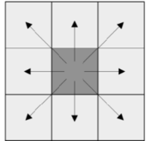

### Mean Patch Area (ha)

Describes the size of patches and classes and the amount of edge. An
edge is defined as the border between two patches of different forest
types.

These metrics mainly characterize the composition of the landscape and
are able to show dominance or rareness of classes.

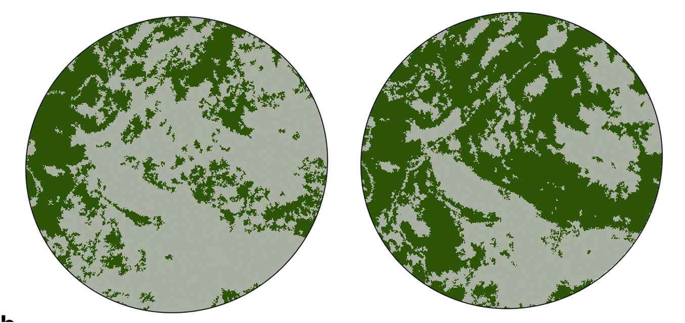

### Patch Shape Index

Describe the shape of patches, mainly by using its area and perimeter (1
= square, ↑ = non-square) This can be important for many research
questions, because, e.g., even though, being equal in size, long and
narrow patches have different characteristics than a squared patch of
the same size.

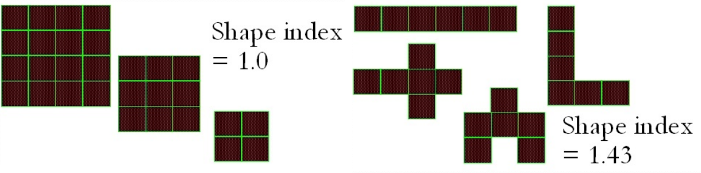

### Shannon’s Diversity Index

Only available on the landscape level (↑ = more diversity). They
describe the abundance and dominance/rareness of classes. Thereby, they
show the diversity of present classes.

<figure>

<figcaption aria-hidden="true">left: less diversity; right: more
diversity</figcaption>
</figure>

## Why FLMs?

When building roads, train tracks or power lines, landscapes are split
into pieces. In other words, landscapes are fragmented.

**What are the consequences?**

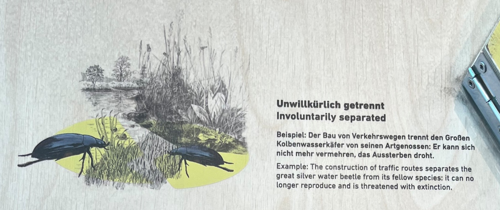  

With FLMs, we can quantify changes in the landscapes, which can then be
attributed to specific events (e.g., road building).

In the same manner, the impact of building infrastructure through the
landscapes can be assessed. This in turn enables better planning in the
context of biodiversity conservation.

With satellite imagery, this analysis can be fully automated and near
real time at no extra cost. The FLM are ready to be analysed in the
F-TEP server.

## F-TEP

For the implementation of FLM, we require only two inputs:

-   **Land Cover map** - Default World LC map available in the FTEP
    platform. Produced by the global component of the Copernicus Land
    Service, derived from PROBA-V satellite observations and ancillary
    datasets.
-   **AOI** – Are of interest in Well-Known-Text format

The output will be one .tif file per metric, containing the results for
a bounding box containing the AOI.

To operate F-TEP, follow the next steps:

1.  Go to the Forestry tep website at <https://f-tep.com/> and click on
    the Platform button on the top-right. 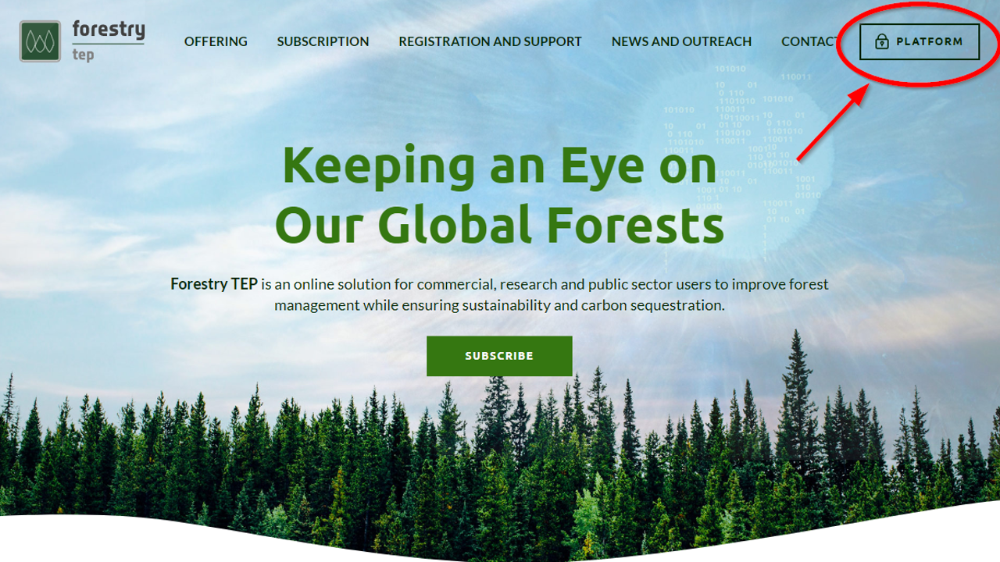

2.  You will be taken to the log-in portal. Enter your guest credentials
    here. 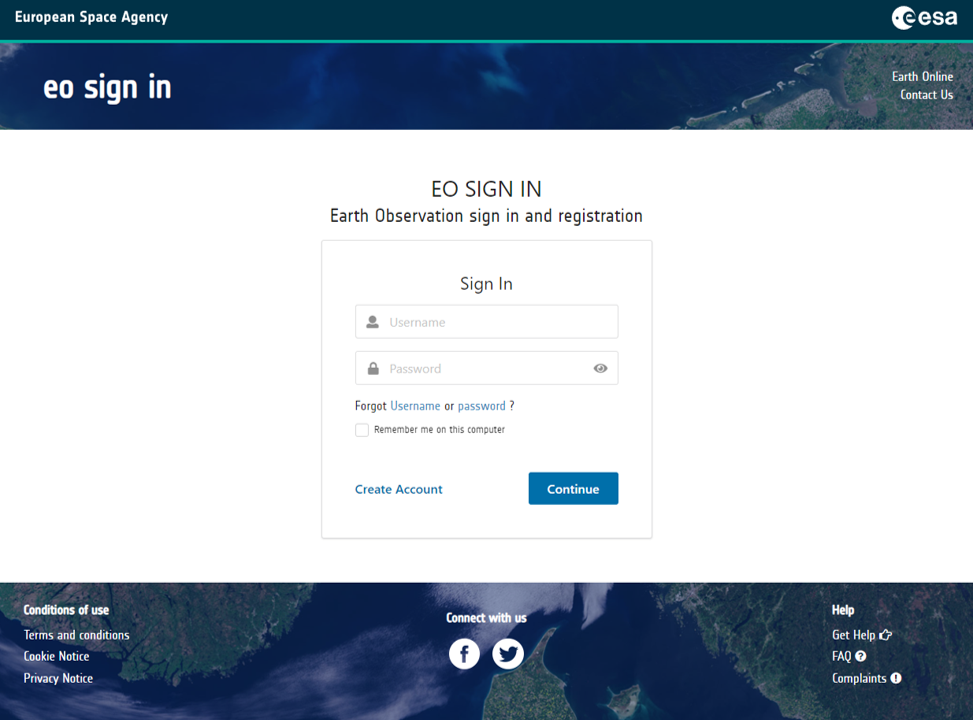

3.  After logging in, the website contains a map. Click on the
    “services” button to access the various services provided by EO4SDG.
    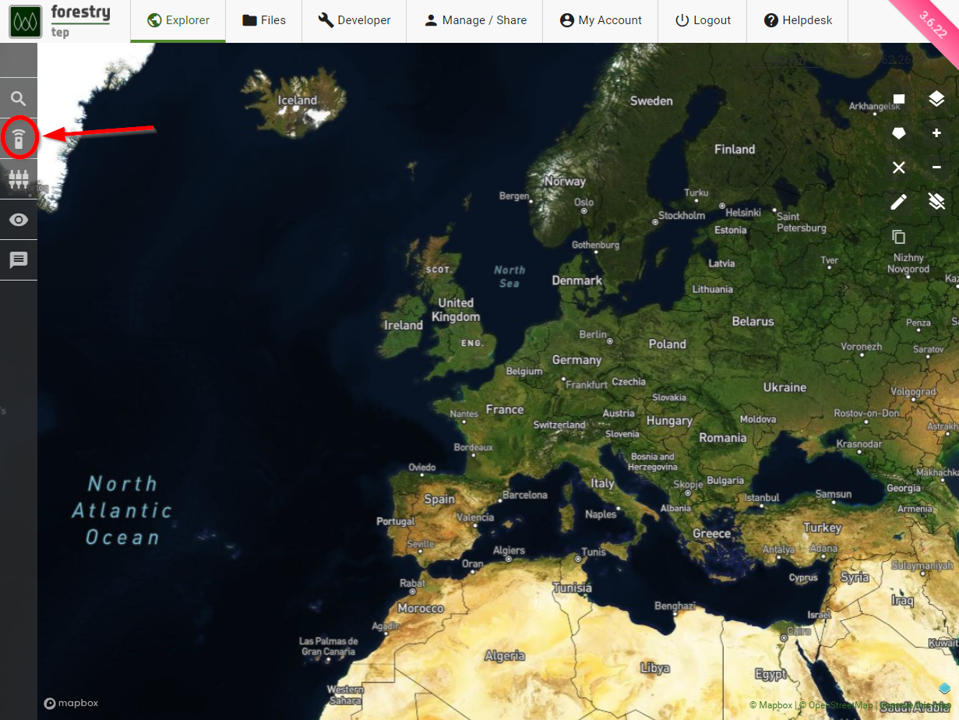

4.  Select the desired service, in this case the one that contains “flm”
    in the name. 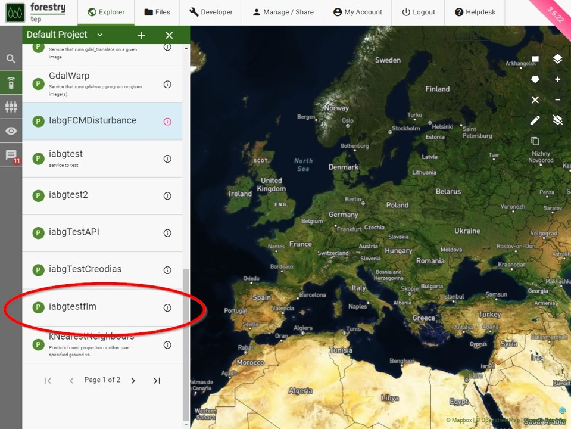

5.  Input your desired aoi in WKT form (B). The input images field
    should be left empty (A). The aoi can be created directly on the
    platform by clicking the square or polygon in the top right (C) and
    then clicking on (D). Alternatively, provide your desired AOI in WKT
    form, for example, POLYGON((105.88 21.32,105.80 21.24, …))
    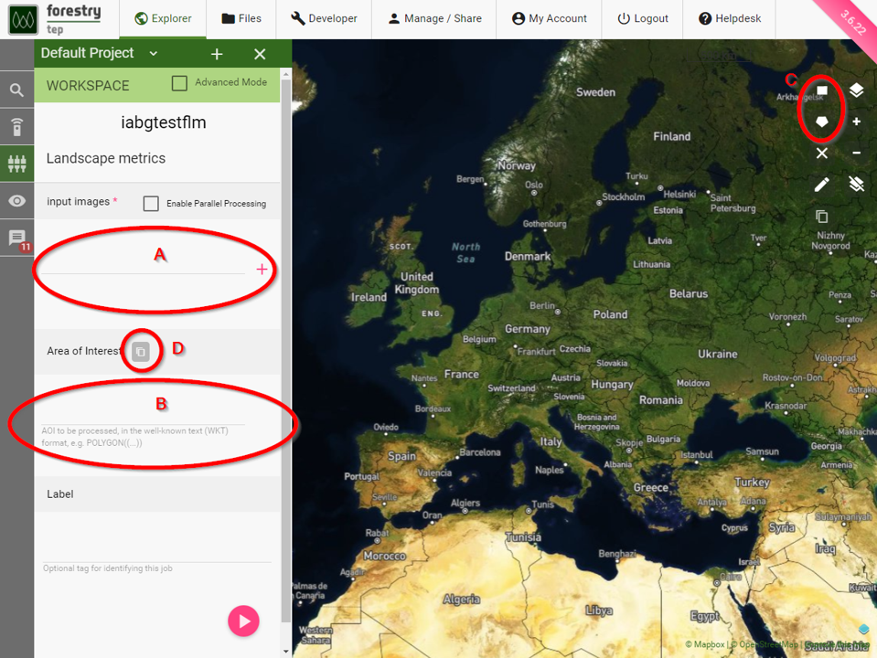

6.  After the above steps are done, press the play button. The results
    can be found under the Results tab in the Jobs section.
    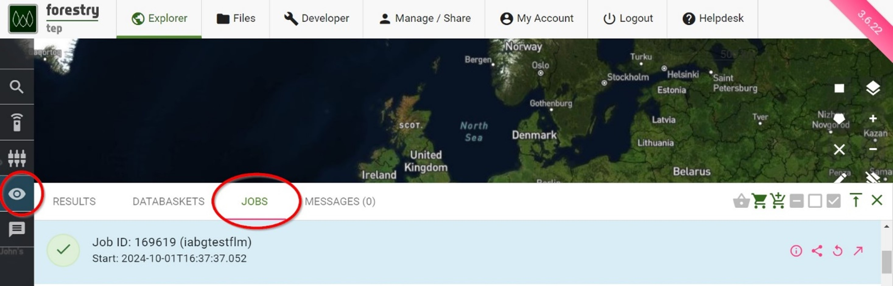

7.  The downloadable files are found in the “Output” tab, once you click
    on the job ID. 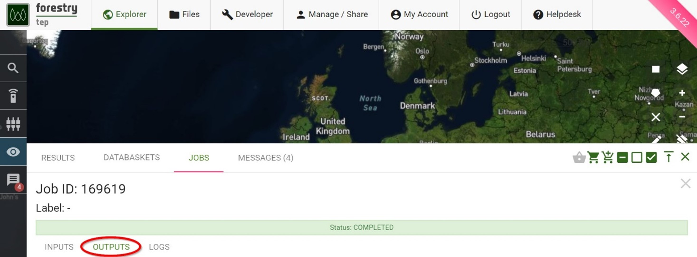

## Results

### Use Case: Vietnam

As stated shortly before, the output files are in .tif format.

In this example we loaded them into R and plotted the results for
applying the FLM to all the Administrative Units (level 3) of Vietnam
inside a specific Province (level 1).

We then aggregated the results by averaging them across the whole
Administrative Unit (level 3).

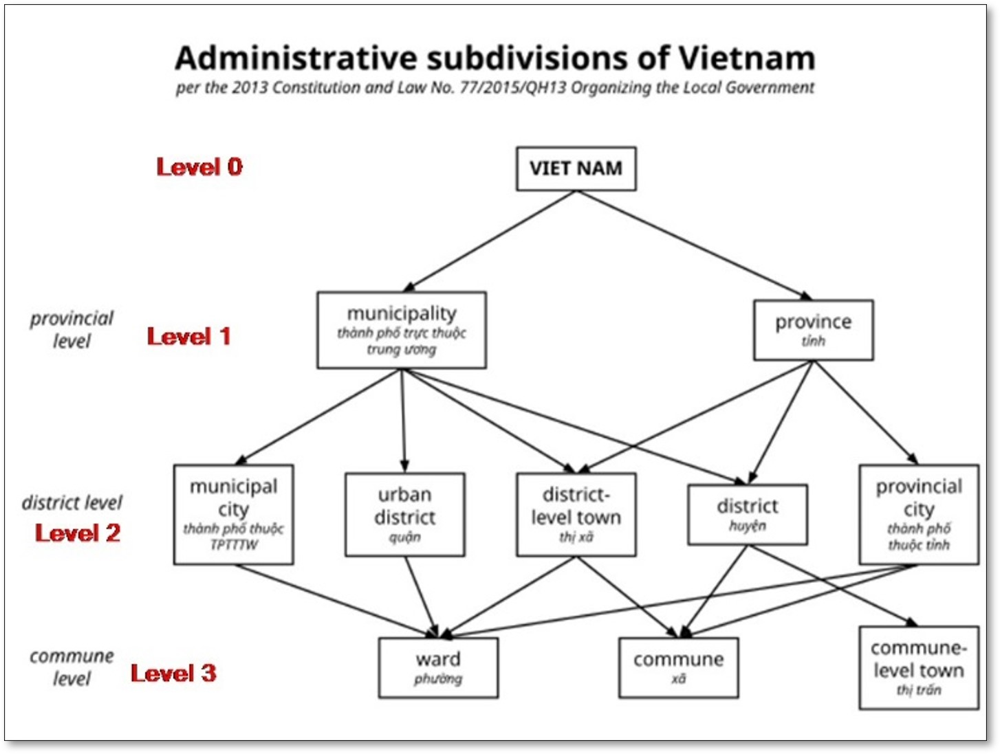

#### Patch Area

Municipalities outside of urban centres and further away from the sea
are richer in forest and have larger average patch areas.

Satellite imagery and the patch distribution across the region support
this finding.

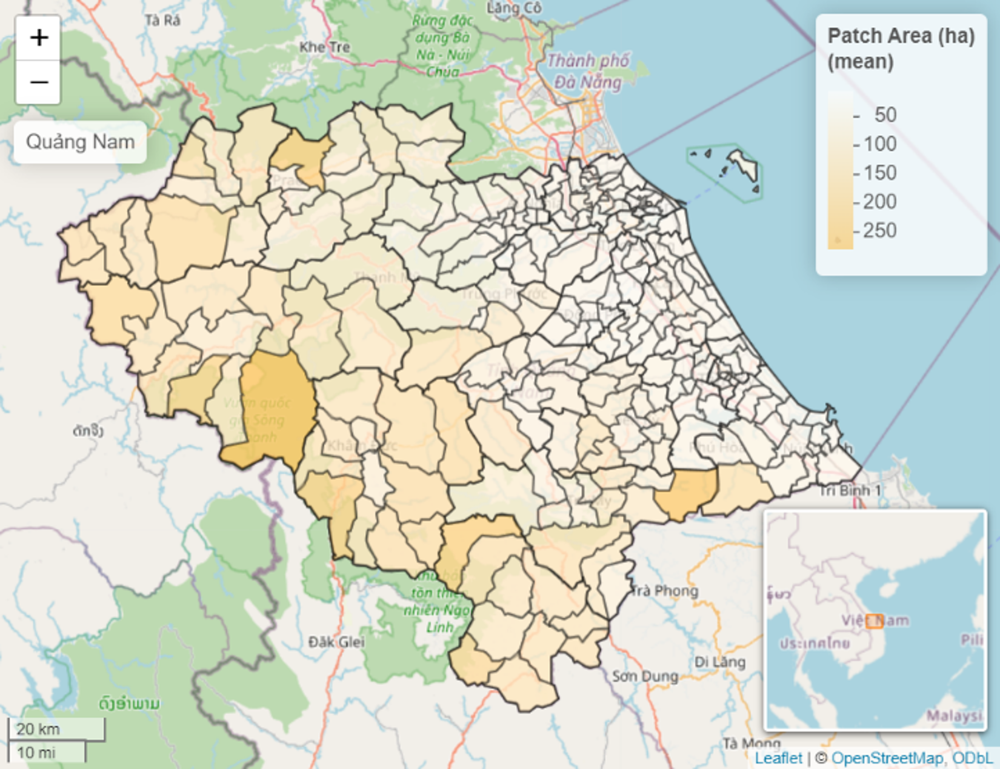

#### Shape Index

The forest patches in Quang Nam, regardless of their location within
their respective regions, do not have very complex and close to squared
shapes.

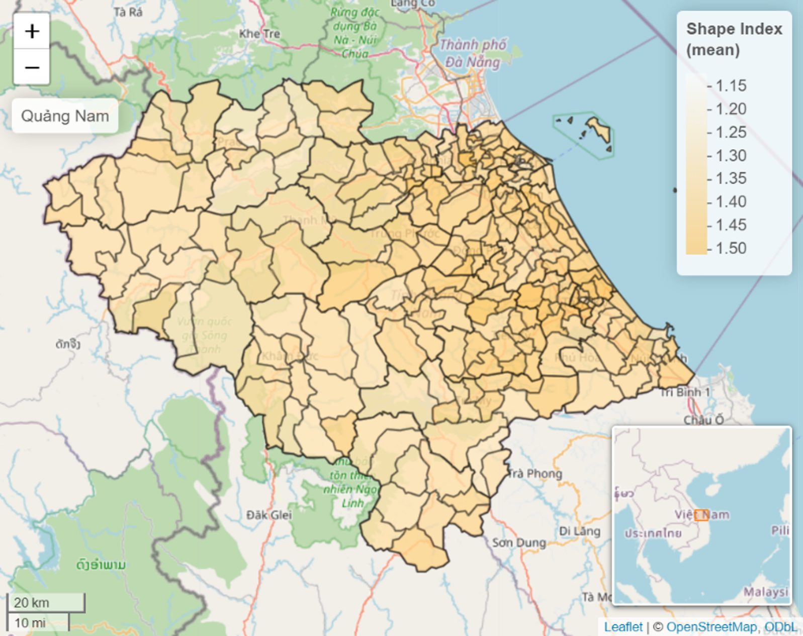

#### Shanon’s Diversity Index

Municipalities with the lowest diversity scores have a clear dominance
of closed evergreen broad leaf forests over all forest types.

Although other forest types may be present in these municipalities, the
Shannon’s diversity metric takes the abundance of a species into account
in its calculation.

The lack of dense broad leaf forests towards the coast gives way to
other species that are relatively more abundant, increasing the
diversity index accordingly.

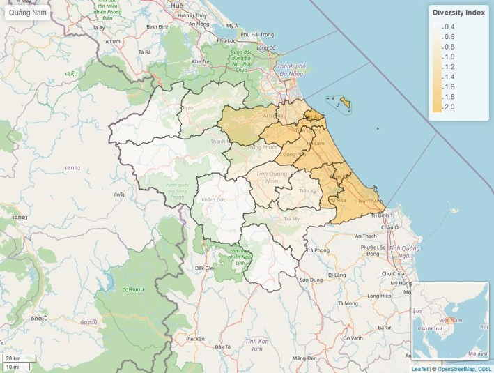

## Summary

In this readme we have gone over the following topics:

-   FLMs quantify landscapes
-   Linked to biodiversity
-   Run analysis online: F-TEP
-   Visualization and aggregation of results

More information is available in the following links:

-   Youtube: <https://www.youtube.com/@eo4sdg-forest-z3c>
-   LinkedIn: www.linkedin.com/company/eo4sdg-forest/
-   Website: <https://eo4sdg.github.io/eo4sdg-site/>
-   GitHub: @eo4sdg
